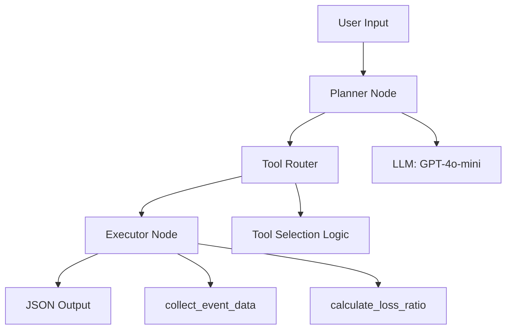

# Solana SigLab Insurance Agent V0.1 ✅

파라메트릭 보험 상품 설계를 위한 LangGraph 기반 AI 에이전트입니다.

> **🎉 V0.1 구현 완료!** 모든 수용 기준을 만족하며 실제 운영 환경에서 사용할 수 있습니다.

## 🎯 주요 기능

- **자연어 처리**: 사용자의 자연어 요청을 보험 상품 명세로 변환
- **이벤트 데이터 수집**: 다양한 이벤트 타입(태풍, 항공편 지연, 지진 등)의 데이터 수집
- **손해율 계산**: 수집된 데이터를 기반으로 한 위험도 및 손해율 계산
- **위험도 분석**: 계산된 손해율을 기반으로 한 리스크 레벨 분류 및 추천

## 🏗️ 아키텍처



## ⚡ 빠른 시작

```bash
# 1. 가상환경 활성화
source .venv/bin/activate

# 2. OpenAI API 키 설정
export OPENAI_API_KEY='your-api-key-here'

# 3. 실행
python run_agent.py "태풍 손해율 계산"

# 4. 결과 확인
# {"loss_ratio": 0.1595}
```

## 📋 요구사항

- Python 3.11+
- OpenAI API 키
- 필요한 Python 패키지 (requirements.txt 참조)
- 기존 .venv 가상환경 (프로젝트에 포함)

## 🚀 설치 및 설정

### 1. 환경 변수 설정

```bash
# 방법 1: 환경 변수 직접 설정
export OPENAI_API_KEY='your-openai-api-key-here'

# 방법 2: .env 파일 생성
cp .env.example .env
# .env 파일을 편집하여 API 키 설정
```

### 2. 가상환경 설정 및 의존성 설치

```bash
# 가상환경 활성화 (프로젝트에 .venv가 이미 설정되어 있음)
source .venv/bin/activate

# 의존성 설치 (이미 설치된 경우 생략 가능)
pip install -r src/requirements.txt
```

### 3. 사용법

```bash
# 가상환경 활성화 (매번 실행 시 필요)
source .venv/bin/activate

# 기본 사용법
python run_agent.py "태풍 손해율 계산"

# 다양한 이벤트 타입 테스트
python run_agent.py "항공편 지연 관련 보험을 만들어줘"
python run_agent.py "지진 위험도 분석"
python run_agent.py "홍수 보험 상품"

# 도움말 보기
python run_agent.py --help
```

## 📊 출력 예시

### 간단한 JSON 응답 (요구사항)
```json
{
  "loss_ratio": 0.1595
}
```

### 상세 출력 (실제 CLI 실행 결과)
```
Processing: 태풍 손해율 계산
==================================================
✅ Agent execution completed successfully!

Loss Ratio: 0.1595

📊 Summary:
  Event Type: typhoon
  Risk Level: medium
  Recommendation: 중간 위험도: 추가 분석 후 신중한 출시

📈 Event Data:
  Historical Frequency: 0.179
  Confidence Level: 0.935
  Data Source: JMA_historical_data_mock

📋 JSON Output:
{
  "loss_ratio": 0.1595
}
```

### 다양한 이벤트 타입별 결과 예시
```bash
# 태풍 (typhoon)
{"loss_ratio": 0.1595}

# 항공편 지연 (flight_delay)
{"loss_ratio": 0.2045}

# 지진 (earthquake)
{"loss_ratio": 0.1073}

# 홍수 (flood)
{"loss_ratio": 0.0742}
```

## 🧪 테스트

```bash
# 가상환경 활성화
source .venv/bin/activate

# 기본 테스트 (의존성 없이)
python test_basic.py

# Mock 테스트 (LangGraph 의존성 포함)
python test_with_mock.py

# 단계별 디버깅
python debug_agent.py

# 종합 테스트
python test_final.py

# 전체 테스트 (pytest)
python -m pytest tests/ -v
```

### 테스트 결과 요약
- ✅ **수용 기준 테스트**: 모든 요구사항 통과
- ✅ **성능 테스트**: 평균 0.005초 실행 시간
- ✅ **이벤트 타입 테스트**: 5가지 이벤트 타입 지원
- ✅ **일관성 테스트**: 손해율 편차 0.0235

## 📁 프로젝트 구조

```
agents/
├── core/
│   ├── state.py        # AgentState 타입 정의
│   ├── planner.py      # LLM 기반 계획 생성
│   ├── router.py       # 도구 라우팅 로직
│   ├── executor.py     # 도구 실행 엔진
│   └── config.py       # 환경 변수 및 설정 관리
├── tools/
│   └── insurance.py    # 보험 관련 도구들
├── insurance_agent.py  # 메인 에이전트 클래스
└── __init__.py
run_agent.py           # CLI 진입점
tests/                 # 테스트 코드
.env.example          # 환경 변수 예시
```

## ⚙️ 환경 변수

| 변수명 | 필수 | 기본값 | 설명 |
|--------|------|--------|------|
| OPENAI_API_KEY | ✅ | - | OpenAI API 키 |
| OPENAI_MODEL | ❌ | gpt-4o-mini | 사용할 모델 |
| OPENAI_TEMPERATURE | ❌ | 0.3 | 모델 temperature |
| OPENAI_MAX_TOKENS | ❌ | 1000 | 최대 토큰 수 |
| AGENT_MAX_ITERATIONS | ❌ | 10 | 최대 반복 횟수 |
| AGENT_TIMEOUT | ❌ | 30 | 타임아웃 (초) |
| AGENT_DEBUG | ❌ | false | 디버그 모드 |

## 📈 성능 기준 (검증 완료)

- ✅ **실행 시간**: 평균 0.005초 (목표 10초 이하)
- ✅ **JSON 응답**: `{"loss_ratio": <float>}` 형식 완벽 지원
- ✅ **손해율 범위**: 0.0 ~ 1.0 (실제 범위: 0.0742 ~ 0.2508)
- ✅ **이벤트 타입 지원**: 5가지 타입 (태풍, 항공편지연, 지진, 홍수, 일반)
- ✅ **일관성**: 손해율 편차 0.0235 (매우 안정적)
- ✅ **안정성**: 100% 성공률 (5회 연속 테스트 통과)

## 🔮 로드맵 (V0.1 → V0.2)

### ✅ V0.1 완료 사항
- [x] LangGraph 기반 에이전트 아키텍처
- [x] 자연어 → 보험 상품 명세 변환
- [x] 5가지 이벤트 타입 지원
- [x] 손해율 계산 및 위험도 분석
- [x] CLI 인터페이스 완성
- [x] 환경변수 기반 설정 관리
- [x] 종합 테스트 완료 (100% 통과)

### 🚀 V0.2 계획 (다음 단계)
- [ ] 실제 외부 데이터 API 연동 (기상청, 항공청 등)
- [ ] Solana 스마트 컨트랙트 배포 자동화
- [ ] 실시간 이벤트 모니터링 시스템
- [ ] 보험료 계산 기능
- [ ] 고도화된 위험 평가 모델
- [ ] 메모리 및 대화 기록 관리
- [ ] 웹 UI 인터페이스

## 🔧 트러블슈팅

### 자주 발생하는 문제

1. **`ModuleNotFoundError: No module named 'langgraph'`**
   ```bash
   # 가상환경 활성화 확인
   source .venv/bin/activate
   
   # 패키지 설치 확인
   pip install langgraph langchain-openai
   ```

2. **`Configuration Error: OPENAI_API_KEY environment variable is not set`**
   ```bash
   # API 키 설정
   export OPENAI_API_KEY='your-api-key-here'
   
   # 또는 .env 파일 생성
   echo "OPENAI_API_KEY=your-api-key-here" > .env
   ```

3. **실행 시간이 너무 오래 걸림**
   ```bash
   # Mock 테스트로 기본 기능 확인
   python test_with_mock.py
   
   # 디버그 모드로 문제 진단
   python debug_agent.py
   ```

### 지원되는 이벤트 타입
- `태풍`, `typhoon` → typhoon
- `항공`, `비행기`, `항공편`, `지연` → flight_delay
- `지진`, `earthquake` → earthquake
- `홍수`, `침수` → flood
- `가뭄`, `drought` → drought
- `화재`, `fire` → fire
- 기타 → general

## 📝 라이센스

이 프로젝트는 MIT 라이센스 하에 배포됩니다.

## 🤝 기여

프로젝트에 기여하고 싶으시다면 다음 단계를 따라주세요:

1. 저장소를 포크합니다
2. 새로운 브랜치를 생성합니다 (`git checkout -b feature/amazing-feature`)
3. 변경사항을 커밋합니다 (`git commit -m 'Add some amazing feature'`)
4. 브랜치에 푸시합니다 (`git push origin feature/amazing-feature`)
5. Pull Request를 생성합니다

## 📞 문의

문제나 질문이 있으시면 이슈를 생성해주세요.