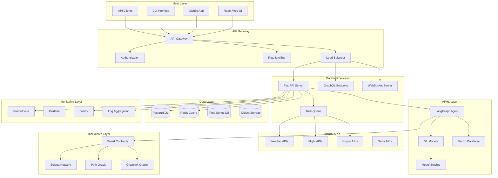
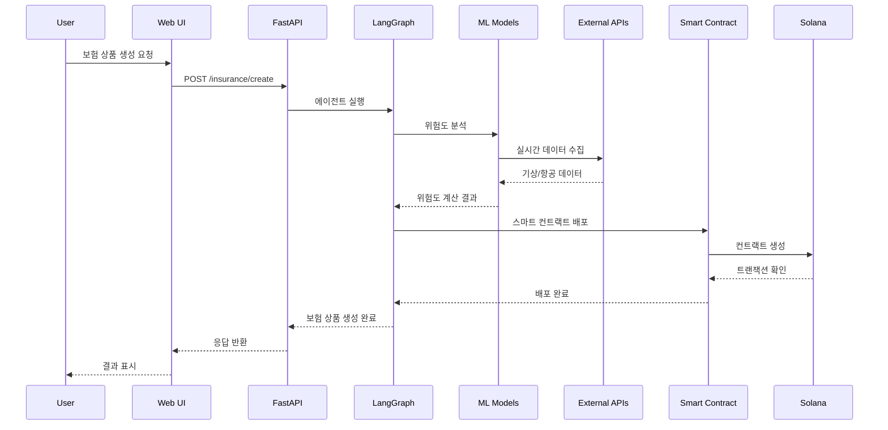
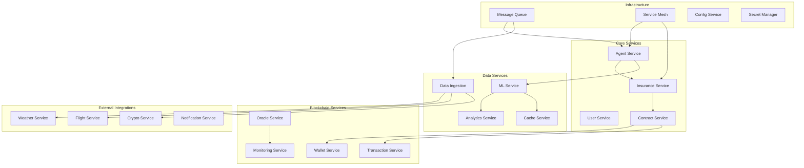
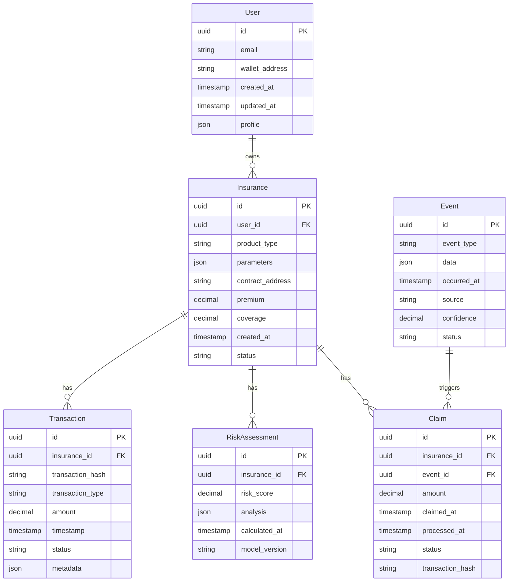
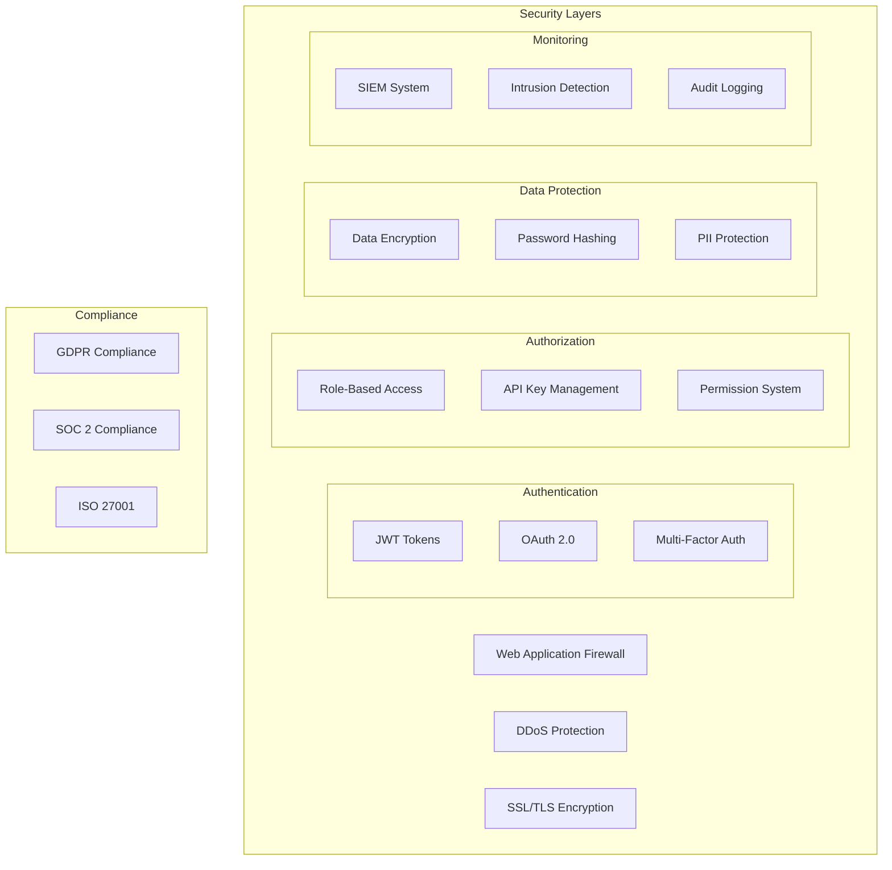
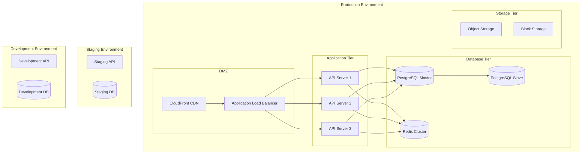

# V0.2 Architecture Diagram

## 🏗️ 전체 시스템 아키텍처

## 🔄 데이터 플로우 다이어그램

## 🏛️ 마이크로서비스 아키텍처

## 🗄️ 데이터베이스 스키마

## 🔧 기술 스택

### Frontend
- **React 18** - 사용자 인터페이스
- **TypeScript** - 타입 안전성
- **Tailwind CSS** - 스타일링
- **React Query** - 상태 관리
- **Wallet Adapter** - 지갑 연동

### Backend
- **FastAPI** - API 서버
- **Python 3.11** - 백엔드 언어
- **PostgreSQL** - 관계형 데이터베이스
- **Redis** - 캐싱 및 세션
- **Celery** - 비동기 작업 처리

### AI/ML
- **LangGraph** - AI 에이전트
- **LangChain** - LLM 통합
- **Scikit-learn** - 머신러닝
- **TensorFlow** - 딥러닝
- **Pandas** - 데이터 처리

### Blockchain
- **Solana** - 블록체인 네트워크
- **Anchor** - 스마트 컨트랙트 프레임워크
- **Pyth Network** - 가격 오라클
- **Chainlink** - 외부 데이터 오라클

### Infrastructure
- **Docker** - 컨테이너화
- **Kubernetes** - 오케스트레이션
- **AWS/GCP** - 클라우드 플랫폼
- **Prometheus** - 모니터링
- **Grafana** - 대시보드

## 🔐 보안 아키텍처

## 🚀 배포 아키텍처

이 아키텍처는 V0.2에서 구현할 전체 시스템의 구조를 보여주며, 확장 가능하고 안정적인 파라메트릭 보험 플랫폼을 구축하기 위한 설계입니다.