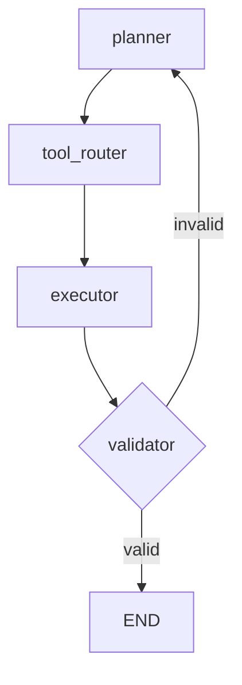

# Solana SigLab Agents 구현 계획

## 개요

Solana SigLab Server의 `agents` 모듈은 LangGraph 프레임워크를 활용한 LMM(Large Multimodal Model) 기반 에이전트로, 파라메트릭 보험 상품 개발 및 자동 보험금 지급을 위한 지능형 에이전트 시스템입니다.

### 파라메트릭 보험 워크플로우
1. **요청 단계**: 유저가 파라메트릭 보험 대상 이벤트에 대하여 요청
2. **분석 및 상품 개발**: AI 에이전트가 대상 이벤트에 대해 손해율을 산정하고 수익성 있는 파라메트릭 보험 상품을 개발 후 판매
3. **자동 지급**: 사전 지정된 조건 충족 시 스마트 컨트랙트로 토큰을 보험금으로 유저에게 지급

## 목표

파라메트릭 보험 상품 개발 및 자동 지급을 위한 지능형 에이전트 시스템 구축:
- 보험 이벤트 데이터를 수집·정제·해석하여 손해율 산정
- 위험 평가 및 보험료 산정 도구를 활용한 수익성 분석
- 스마트 컨트랙트 조건 검증 및 자동 보험금 지급 트리거
- 완전 자동화된 파라메트릭 보험 운영 파이프라인 구현

## 1. 에이전트 전반 구조

### 계층별 구성요소

| 계층 | 구성요소 | 주요 책임 |
|------|----------|-----------|
| ① Planner (LMM) | GPT-4.1 / Gemini 2.5 class LMM | 사용자의 보험 요청 → "손해율 산정 및 상품 개발 계획" 생성 |
| ② Tool Router | LangGraph function-calling 라우터 | Planner가 호출한 함수를 보험 분석 및 블록체인 도구로 매핑 |
| ③ Execution Layer | Python + FastAPI 마이크로서비스 | - 보험 이벤트 데이터 수집 API<br>- 손해율 산정 모델<br>- 보험료 계산 엔진<br>- 스마트 컨트랙트 인터페이스 |
| ④ Memory / KB | Vector DB + Conversation Memory | 과거 보험 이벤트 유사도 검색, 손해율 히스토리 조회 |
| Ⅴ Validation Guard | 검증 체인 + 정책엔진 | 결과 정합성(주소 형식·네트워크 검증) 체크 & 에이전트 재시도 |
| Ⅵ Audit Trail | Prompt/Action/Result 로그 | 모델 거버넌스·블록체인 분석 보고서 자동 생성 |

### LangGraph 설계 원칙

LangGraph는 "계획 → 행동 → 관찰" 루프를 *그래프* 형태로 선언·실행할 수 있는 프레임워크입니다. 각 **노드(Node)** 는 LLM·Tool·함수 호출 등을 담당하고, **에지(Edge)** 는 조건부 분기·루프·종료를 정의합니다. Solana SigLab 보험 에이전트는 다음과 같은 그래프 구조를 채택합니다.

| 노드 ID | 역할 | 구현 파일 |
|---------|------|-----------|
| `planner` | 사용자의 자연어 요청을 파싱하여 고수준 **Plan**(손해율 산정 → 보험료 계산 → 상품 생성 …) 생성 | `agents/core/planner.py` |
| `tool_router` | Plan 단계별로 호출할 Tool 을 결정하고 파라미터 빌드 | `agents/core/router.py` |
| `executor` | 실제 Python/FastAPI 마이크로서비스로 Tool 실행, 결과 수집 | `agents/core/executor.py` |
| `validator` | 출력값 스키마·정책 검증, 실패 시 `planner` 로 리루트 | `agents/validation/guards.py` |
| `END` | 모든 단계가 완료되면 그래프 종료 | (LangGraph 내장) |

#### Graph 정의 예시 (Python)
```python
from typing import TypedDict, Any
from langgraph.graph import StateGraph, END

class AgentState(TypedDict):
    messages: list[dict]
    plan: str
    result: Any

# 1) 그래프 객체 생성
graph = StateGraph(AgentState)

# 2) 노드 등록
graph.add_node("planner", planner_chain)
graph.add_node("tool_router", tool_router)
graph.add_node("executor", executor_layer)
graph.add_node("validator", validator_guard)

# 3) 에지(흐름) 정의
graph.add_edge("planner", "tool_router")
graph.add_edge("tool_router", "executor")
graph.add_edge("executor", "validator")
# 유효성 검증 통과 시 종료, 실패 시 재계획
graph.add_conditional_edges(
    "validator",
    {
        "valid": END,
        "invalid": "planner",
    },
)

# 4) 컴파일 & 실행
agent = graph.compile()
result = agent.invoke({"messages": user_messages})
```

> 📌 **LangGraph Best Practice**: `StateGraph` 의 **타입 정의**(위 예시의 `AgentState`)를 명시하여 각 노드 I/O 타입 안정성을 확보하고, `add_conditional_edges` 로 재시도·가드 로직을 선언적으로 표현합니다.

### 프레임워크 선택 근거
LangGraph는 2025년형 오픈소스 프레임워크로 계획→행동→관찰 루프와 도구 타입 세이프티가 성숙해 파라메트릭 보험 워크플로우 자동화에 최적화됨

## 2. Tool 카탈로그 (파라메트릭 보험 도구)

| Tool ID | 엔드포인트 | I/O 예시 | 설명 |
|---------|------------|----------|------|
| `insurance.collect_event_data` | `/events/collect` | (event_type, params) → 이벤트 데이터 | 보험 이벤트 데이터 수집 |
| `insurance.calculate_loss_ratio` | `/analysis/loss_ratio` | (event_data) → 손해율 | 손해율 산정 |
| `insurance.assess_risk` | `/analysis/risk` | (event_params) → 위험도 | 위험 평가 |
| `insurance.calculate_premium` | `/pricing/premium` | (risk_data) → 보험료 | 보험료 계산 |
| `insurance.create_product` | `/products/create` | (product_specs) → 상품 정보 | 보험 상품 생성 |
| `insurance.validate_conditions` | `/contracts/validate` | (conditions) → 검증 결과 | 보험금 지급 조건 검증 |
| `blockchain.deploy_contract` | `/contracts/deploy` | (contract_data) → 컨트랙트 주소 | 스마트 컨트랙트 배포 |
| `blockchain.trigger_payout` | `/contracts/payout` | (contract_addr, amount) → 거래 해시 | 보험금 자동 지급 |
| `report.gen_insurance` | `/report/insurance` | (product_data) → PDF | 보험 상품 보고서 생성 |

각 Tool 함수 시그니처는 **LangGraph Function Schema**(JSON Schema 기반)로 정의되어 `StateGraph.compile()` 시 자동 검증됩니다. 시스템 프롬프트에는 해당 스키마가 삽입되어 자연어 보험 요청 → 안전한 함수 호출로 이어집니다.

### LangGraph 상태 & 스키마 매핑
```python
class AgentState(TypedDict):
    messages: list[dict]         # 대화 기록
    plan: str                    # planner 가 생성한 단계형 계획
    tool_call: dict | None       # 현재 실행할 tool payload
    result: dict | None          # tool 실행 결과
```
> 모든 Tool 은 `input_schema`, `output_schema` 메타데이터를 가지며, `validator` 노드에서 `pydantic` 검증을 통과해야 다음 에지로 이동합니다.

## 3. LangGraph Reasoning Flow



### Pseudo-prompt 예시
```system
You are Solana SigLab Insurance Agent running on LangGraph.
State keys: messages, plan, result.
Available tools: insurance.collect_event_data, insurance.calculate_loss_ratio, insurance.calculate_premium, ...
```
```user
"태풍으로 인한 농작물 피해 보험 상품을 개발해주세요."
```
```planner_output
Plan:
1. Collect typhoon event data (insurance.collect_event_data)
2. Calculate historical loss ratio for typhoon events (insurance.calculate_loss_ratio)
3. Assess agricultural damage risk
4. Calculate premium (insurance.calculate_premium)
5. Create insurance product (insurance.create_product)
6. Deploy contract (blockchain.deploy_contract)
7. Generate report (report.gen_insurance)
```

## 4. 모델·데이터 파이프라인 세부

| 단계 | 구현 포인트 |
|------|-------------|
| 데이터 인제스트 | 외부 API → 보험 이벤트 실시간 데이터 수집 |
| 피처링 Tool | Execution Layer에서 이벤트 데이터 → 위험 평가 피처 |
| 분석 모델 | ML 기반 손해율 예측 및 위험도 분석 |
| 온라인 러닝 | 실시간 보험 청구 데이터로 모델 업데이트 |
| 안전장치 | 보험 조건 검증, 지급 한도 체크 |

## 5. 품질·거버넌스

| 항목 | 메트릭 | SLO |
|------|--------|-----|
| 손해율 예측 정확도 | > 85% (과거 데이터 기준) |
| 보험료 산정 정확도 | > 90% (수익성 기준) |
| Tool 호출 실패율 | < 1% |
| 자동 재시도 한계 | 3회 |
| 설명 가능성 | 95% "Why?" 쿼리 응답 성공 |
| 보험금 지급 정확도 | > 99% (조건 충족 시) |

### A/B 안전 가드
신규 모델은 트래픽 10%→25%→50% 단계별 확대, 오류 발생 시 즉시 롤백

## 6. DevOps·MLOps 파이프라인

- **코드**: monorepo (Firebase Functions + LangGraph)
- **CI/CD**: GitHub Actions → Firebase Deploy
- **Observability**: Firebase Logging + 구조화된 로깅
- **Security**: Firebase Auth + Input Validation

## 7. 실행 로드맵

| Sprint | 목표 | 산출물 |
|--------|------|--------|
| S1 | 보험 Tool API 3종 PoC | collect_event_data, calculate_loss_ratio, assess_risk |
| S2 | LangGraph 그래프 구축 & 컴파일 | planner/router 노드 연결, Function Schema 정의, `StateGraph.compile()` 통과 |
| S3 | 보험 Guard rails & Audit Trail | 보험 정책엔진, 전량 보험 거래 로그 |
| S4 | 스마트 컨트랙트 연동 | deploy_contract, trigger_payout, validate_conditions |

## 8. 현재 구현 상태

### 기존 구조 (v1.0)
```
agents/
├── __init__.py          # 기본 에이전트 exports
├── agent.py            # 메인 에이전트 구현
├── langgraph.json      # LangGraph 설정
├── memory.py           # 대화 메모리 관리
└── utils/              # 유틸리티
    ├── state.py        # 상태 정의
    ├── tools.py        # Solana 도구들
    └── nodes.py        # 그래프 노드 함수들
```

### 목표 구조 (LMM Agent)
```
agents/
├── core/               # 핵심 에이전트 로직
│   ├── planner.py     # LMM 기반 계획 수립
│   ├── router.py      # 도구 라우팅
│   └── executor.py    # 실행 레이어
├── tools/             # 보험 도구 확장
│   ├── insurance.py   # 보험 분석 도구
│   ├── blockchain.py  # 블록체인 인터페이스
│   ├── analytics.py   # 손해율 분석 도구
│   └── reporting.py   # 보험 보고서 생성
├── memory/            # 메모리 시스템
│   ├── vector_store.py # 벡터 검색
│   └── conversation.py # 대화 메모리
├── validation/        # 검증 시스템
│   ├── guards.py      # 안전 가드
│   └── policies.py    # 정책 엔진
└── monitoring/        # 모니터링
    ├── audit.py       # 감사 로그
    └── metrics.py     # 성능 메트릭
```
